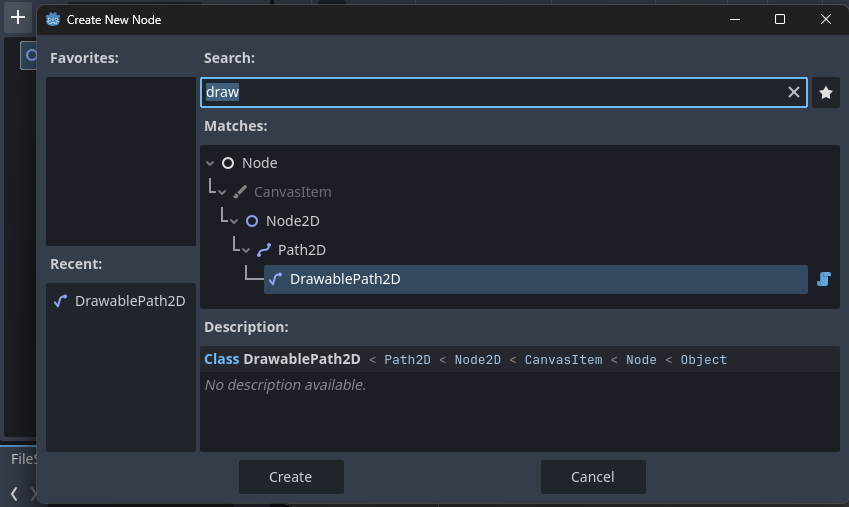
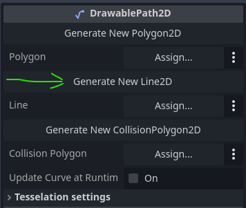
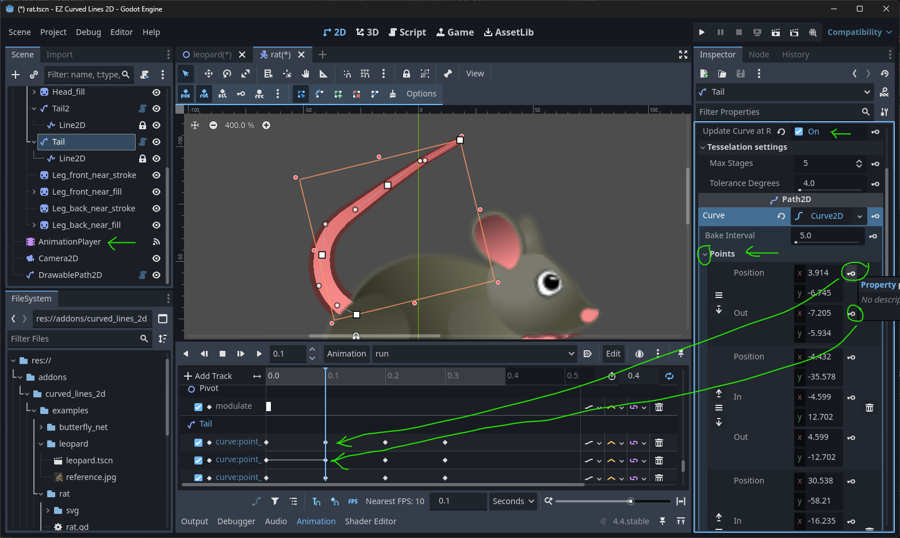
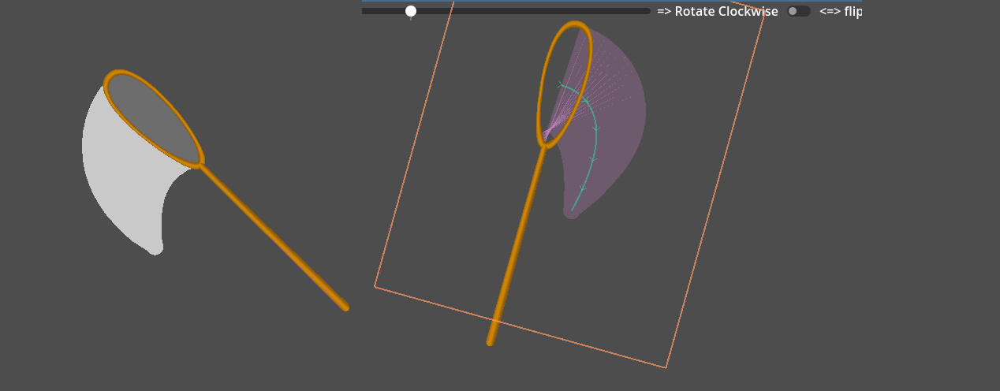
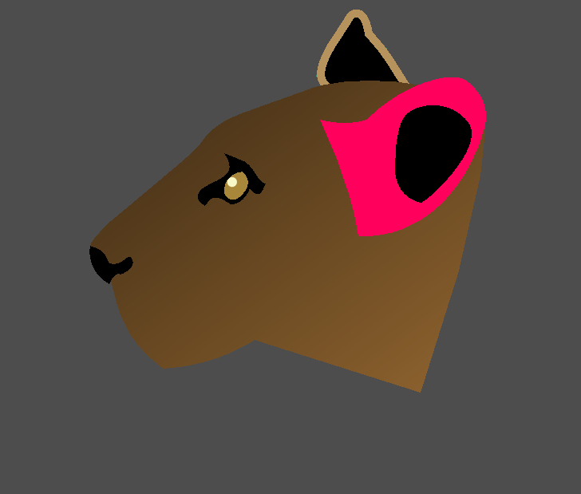
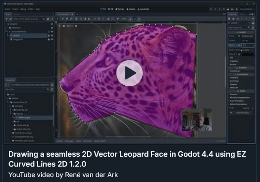

# EZ Curved Lines 2D for Godot 4.4

This plugin helps you draw smooth curved 2D lines, polygons and collision polygons quickly in the 2D editor.

Using godot's `AnimationPlayer` you can even create key frames for the curves lines to animate them.

- [EZ Curved Lines 2D for Godot 4.4](#ez-curved-lines-2d-for-godot-44)
	- [Quick Start](#quick-start)
		- [1. Create a new 2D Scene](#1-create-a-new-2d-scene)
		- [2. Add a `DrawablePath2D` node to you scene tree (Ctrl + A)](#2-add-a-drawablepath2d-node-to-you-scene-tree-ctrl--a)
		- [3. In the `Inspector` tab click the `Generate New Line2D` button](#3-in-the-inspector-tab-click-the-generate-new-line2d-button)
		- [4. Start drawing your `DrawablePath2D` like a normal `Path2D`](#4-start-drawing-your-drawablepath2d-like-a-normal-path2d)
		- [5. You can change the properties of the `Line2D` in the inspector](#5-you-can-change-the-properties-of-the-line2d-in-the-inspector)
	- [Animating](#animating)
		- [Add keyframes in an animation player](#add-keyframes-in-an-animation-player)
		- [Performance impact](#performance-impact)
	- [Polygon2D and CollisionPolygon2D - new in version 1.2.0](#polygon2d-and-collisionpolygon2d---new-in-version-120)
		- [Note on assigning CollisinPolygon2D](#note-on-assigning-collisinpolygon2d)
	- [Examples](#examples)
		- [A simple animated polygon](#a-simple-animated-polygon)
		- [Rat's tail](#rats-tail)
		- [Rotating butterfly net](#rotating-butterfly-net)
		- [The start of a leopard face](#the-start-of-a-leopard-face)
	- [Explainer on Youtube](#explainer-on-youtube)
	- [Leopard face timelapse on Youtube](#leopard-face-timelapse-on-youtube)
	- [Attributions](#attributions)
	- [SVG Path importer TODO](#svg-path-importer-todo)
		- [Must have](#must-have)
		- [Should have](#should-have)
		- [Could have](#could-have)
		- [Would be nice](#would-be-nice)

## Quick Start

After activating this plugin via `Project > Plugins` follow these steps.

### 1. Create a new 2D Scene

### 2. Add a `DrawablePath2D` node to you scene tree (Ctrl + A)

### 3. In the `Inspector` tab click the `Generate New Line2D` button

### 4. Start drawing your `DrawablePath2D` like a normal `Path2D`

Adding and manipulating points the normal way you would for a `Path2D`.

Creating curves using the `Select Control Points` mode:

.

### 5. You can change the properties of the `Line2D` in the inspector

Your new line will update every time you change the `Curve2D` of your `Path2D`

## Animating

You can use the `Update Curve at Runtime` checkbox to enable dynamic changing of your curved shapes at runtime.

### Add keyframes in an animation player

You can then add an `AnimationPlayer` node to your scene, create a new animation and create keyframes for your `Curve > Points` (in the inspector):

### Performance impact
This does, however impact performance of your game somewhat, because calculating curves is an expensive operation.
It should be used sparingly.

Under `Tesselation settings` you can lower `Max Stages` or bump up `Tolerance Degrees` to
reduce curve smoothness and increase performace.

## Polygon2D and CollisionPolygon2D - new in version 1.2.0

Version 1.2 adds the exciting new ability to create curved Polygon2D and CollisionPolygon2D!

An updated quick start and youtube explainer will follow as soon as I have some more time available

They can be assigned to the DrawablePath2D node the same way as a Line2D (explained in the quickstart).

### Note on assigning CollisinPolygon2D

Note, however, that a `CollisionPolygon2D` will at first be generated as a direct child of the `DrawablePath2D` using
the `Generate CollisionPolygon2D` button, but it _does not_ need to be a child to remain succesfully assigned.

This way you can move it up the hierarchy of your scene to become a direct descendant of a `CollisionObject2D` (like `Area2D`, `StaticBody2D` or `CharacterBody2D`)

## Examples

### A simple animated polygon

### Rat's tail

### Rotating butterfly net

### The start of a leopard face

## Explainer on Youtube

## Leopard face timelapse on Youtube

## Attributions

This plugin was fully inspired by [Mark Hedberg's blog on rendering curves in Godot](https://www.hedberggames.com/blog/rendering-curves-in-godot).

The suggestion to support both `Polygon2D` and `CollisionPolygon2D` was done by [GeminiSquishGames](https://github.com/GeminiSquishGames)

## SVG Path importer TODO

### Must have

- [x] Rectangle to path converter (incl. rx and ry)
- [x] Circle and ellipse to path converter
- [x] Polygon and polyline to path converter
- [x] Code clean up (Circle2D replaced by path conversion)
- [x] Set node-position to path center (reset and remember node transforms, get center of computed points, set subtract center from curve points, reapply transforms)
- [x] Style support: opacity, stroke-opacity,
- [ ] Style support: paint-order
- [ ] Show warnings and hints for unsupported stuff: esp. style-node style-named attributes and arcs
- [ ] Undo / Redo (Undo = delete SvgImport node)

### Should have
- [x] Better path attribute string parsing (support leading and trailing whitespace, newlines)
- [ ] Add button to editor to call center node position func
- [ ] Linear and Radial Gradients
- [ ] Quadratic bezier curves
- [ ] styles from style named attributes (i.e. stroke-width, stroke, etc)

### Could have
- [ ] css named colors (see: https://github.com/colorjs/color-name/blob/master/index.js)
- [ ] It should be easier to select DrawableCurve2D in the 2D editor window
- [ ] Set 'offset' from editor, repositioning path around this new position
- [ ] Import inkscape pivot point

### Would be nice

- [ ] Arcs to cubic bezier curve conversion
