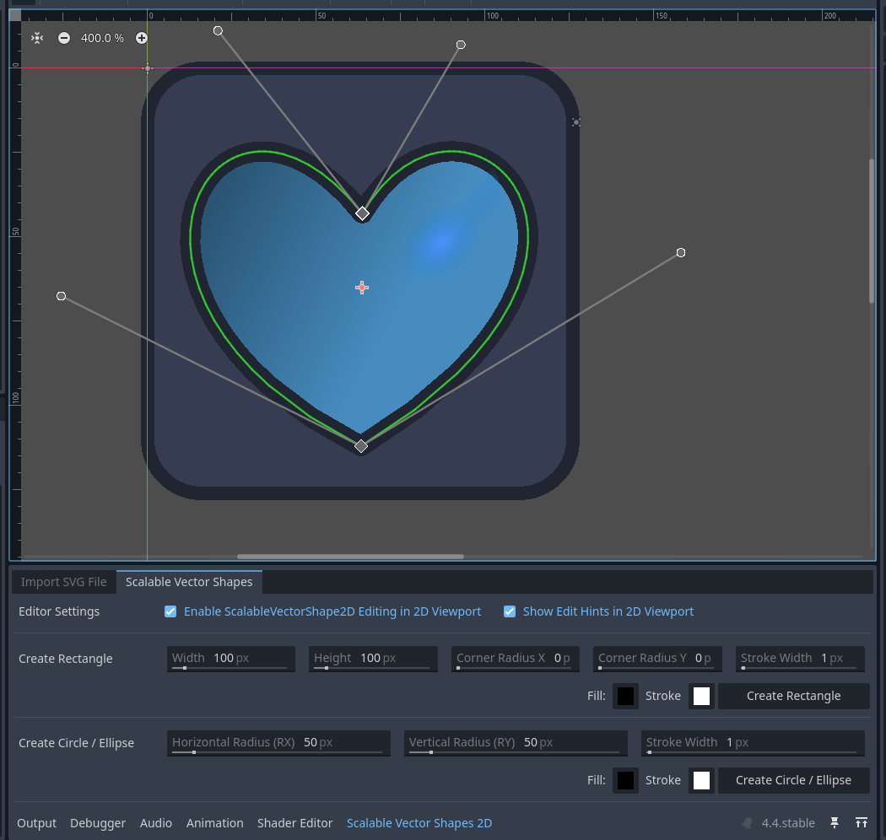
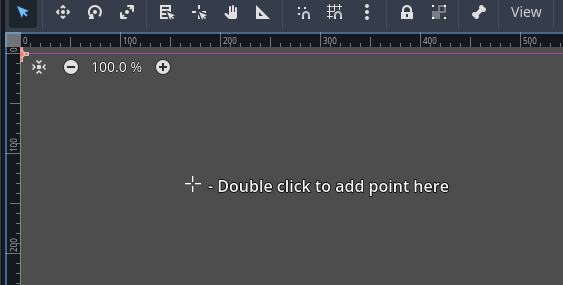
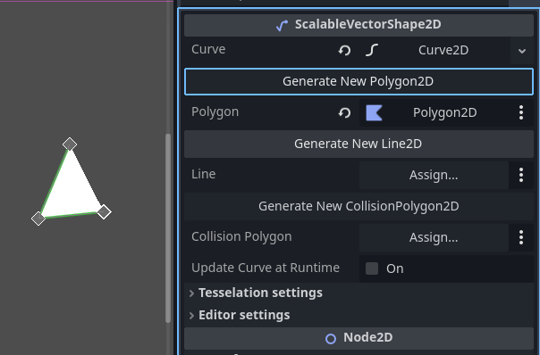
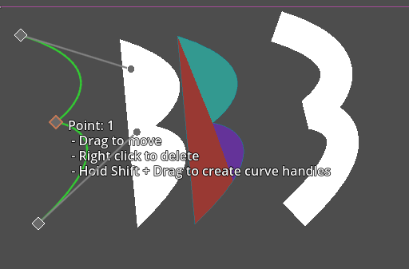
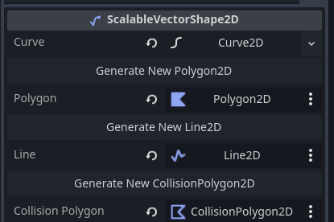
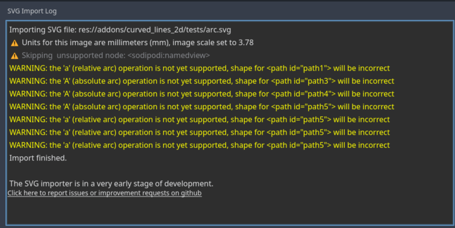
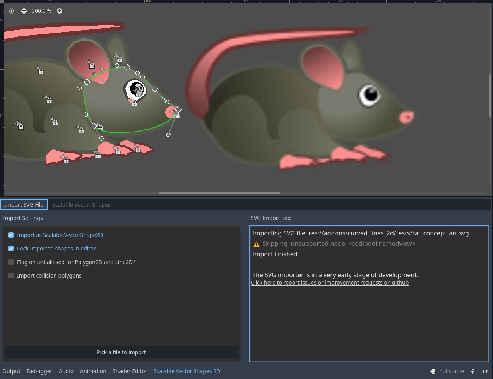
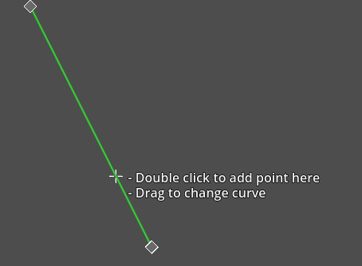
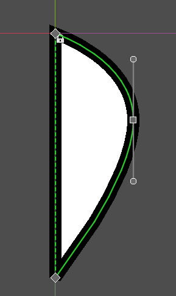
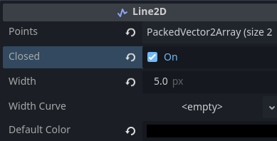

# Scalable Vector Shapes 2D plugin for Godot 4.4

Scalable Vector Shapes 2D lets you do 2 things:
1. Draw seamless vector shapes using a Path Editor inspired by the awesome [Inkscape](https://inkscape.org/)
2. Import [.svg](https://www.w3.org/TR/SVG/) files as seamless vector shapes in stead of as raster images

*__Important sidenote__: _This plugin only supports a small - yet relevant - subset of the huge [SVG Specification](https://www.w3.org/TR/SVG/struct.html)_

## Looking for EZ Curved Lines 2D?
The renamed plugin deprecates the old `DrawablePath2D` custom node in favor of `ScalableVectorShape2D`. A Conversion button is provided:

The reason is that `ScalableVectorShape2D` inherits directly from `Node2D` giving much more control to the plugin over how you can draw.

## Reaching out / Contributing
If you have feedback on this project, feel free to post an [issue](https://github.com/Teaching-myself-Godot/ez-curved-lines-2d/issues) on github, or to:

- Contact me on bluesky: [@zucht2.bsky.social](https://bsky.app/profile/zucht2.bsky.social).
- Try my free to play games on itch.io: [@renevanderark.itch.io](https://renevanderark.itch.io)

If you'd like to improve on the code yourself, ideally use a fork and make a pull request.

This stuff makes me zero money, so you can always branch off in your own direction if you're in a hurry.

# Table of Contents

- [Scalable Vector Shapes 2D plugin for Godot 4.4](#scalable-vector-shapes-2d-plugin-for-godot-44)
	- [Looking for EZ Curved Lines 2D?](#looking-for-ez-curved-lines-2d)
	- [Reaching out / Contributing](#reaching-out--contributing)
- [Table of Contents](#table-of-contents)
- [Drawing Shapes in the Godot 2D Viewport](#drawing-shapes-in-the-godot-2d-viewport)
	- [Adding a `ScalableVectorShape2D` node to your scene](#adding-a-scalablevectorshape2d-node-to-your-scene)
		- [Double click to add points](#double-click-to-add-points)
		- [Adding a `Line2D` as stroke and a `Polygon2D` as fill](#adding-a-line2d-as-stroke-and-a-polygon2d-as-fill)
		- [More about assigned `Line2D`, `Polygon2D` and `CollisionPolygon2D`](#more-about-assigned-line2d-polygon2d-and-collisionpolygon2d)
			- [The assigned shapes are now siblings](#the-assigned-shapes-are-now-siblings)
			- [Yet they still respond to changes to your `ScalableVectorShape2D`](#yet-they-still-respond-to-changes-to-your-scalablevectorshape2d)
			- [Because you assigned them to it using the inspector](#because-you-assigned-them-to-it-using-the-inspector)
	- [Generating a Circle, Ellipse or Rectangle using the bottom panel item](#generating-a-circle-ellipse-or-rectangle-using-the-bottom-panel-item)
	- [Using the `.svg` importer](#using-the-svg-importer)
- [Manipulating shapes](#manipulating-shapes)
	- [Adding a point to a shape](#adding-a-point-to-a-shape)
	- [Bending a curve](#bending-a-curve)
	- [Creating, mirroring and dragging control point handles](#creating-mirroring-and-dragging-control-point-handles)
	- [Closing the loop and breaking the loop](#closing-the-loop-and-breaking-the-loop)
	- [Using `closed` on `Line2D`](#using-closed-on-line2d)
	- [Deleting points and control points](#deleting-points-and-control-points)
	- [Setting the pivot of your shape](#setting-the-pivot-of-your-shape)
- [Animating / Changing shapes at runtime](#animating--changing-shapes-at-runtime)
	- [Update curve at Runtime](#update-curve-at-runtime)
	- [Add keyframes in an animation player](#add-keyframes-in-an-animation-player)
	- [Don't duplicate `ScalableVectorShape2D`, use the `path_changed` signal in stead](#dont-duplicate-scalablevectorshape2d-use-the-path_changed-signal-in-stead)
	- [Performance impact](#performance-impact)
- [Ye Olde `DrawablePath2D` Examples](#ye-olde-drawablepath2d-examples)
- [Attributions](#attributions)
- [Wishlist / Roadmap](#wishlist--roadmap)
	- [Must have (MVP)](#must-have-mvp)
	- [Should have](#should-have)
	- [Could have](#could-have)
	- [Would be nice (if I learn how to)](#would-be-nice-if-i-learn-how-to)

# Drawing Shapes in the Godot 2D Viewport

After activating this plugin a new bottom panel item appears, called "Scalable Vector Graphics".

There are 3 ways to start drawing:
1. [Add a `ScalableVectorShape2D` node to your scene](#adding-a-scalablevectorshape2d-node-to-your-scene)
2.  [Generating a Circle or Rectangle using the bottom panel item](#generating-a-circle-or-rectangle-using-the-bottom-panel-item)
3.  [Using the `.svg` importer](#using-the-svg-importer)

## Adding a `ScalableVectorShape2D` node to your scene

This works exactly the same way as adding a normal godot node, using `Ctrl-A` or using right-click inside the 2D viewport and choosing `Add Node here`:

### Double click to add points

Once you added your new node, a hint should suggest you add points using double click (as long as you're in edit mode):

### Adding a `Line2D` as stroke and a `Polygon2D` as fill

After adding at least 2 points you can use the `Inspector` panel to generate a `Line2D` and/or a `Polygon2D` to serve as stroke and fill:

[Skip to further reading about manipulating shapes](#manipulating-shapes)

### More about assigned `Line2D`, `Polygon2D` and `CollisionPolygon2D`

Using the `Generate ...` buttons in the inspector simply adds a new node as a child to `ScalableVectorShape2D` but it does __not need to be__ a child. The important bit is that the new node is _assigned_ to it via its properties: `polygon`, `line` and `collision_polygon`:

#### The assigned shapes are now siblings

#### Yet they still respond to changes to your `ScalableVectorShape2D`

#### Because you assigned them to it using the inspector

## Generating a Circle, Ellipse or Rectangle using the bottom panel item

It's probably easier to start out with a basic primitive shape (like you would in Inkscape <3)

The second tab in the `Scalable Vector Shapes` panel gives you some basic choices:

This youtube short shows what adding a circle looks like:

## Using the `.svg` importer

As mentioned in the introduction, the `.svg` import supports a small - _yet relevant_ - subset of the [W3C specification](https://www.w3.org/TR/SVG/).

That being said, it's still pretty cool and serves my purposes quite well. You can drag any `.svg` resource file into the first tab of the bottom dock to see if it works for you too:

On the left side of this panel is a form with a couple of options you can experiment with. On the right side is an import log, which will show warnings of known problems, usually unsupported stuff:

As the link in the log suggest, you can report [issues](https://github.com/Teaching-myself-Godot/ez-curved-lines-2d/issues) on github; be sure to check if something is already listed.

Don't let that stop you, though, your future infinite zoomer and key-frame animator will love you for it:

# Manipulating shapes

The hints in the 2D viewport should have you covered, but this section lists all the operations available to you.

## Adding a point to a shape

Using double click you can add a point. Be aware that after adding the second point, you are expected to add new points __within__ the resulting polygon:

## Bending a curve

Holding the mouse over line segment you can start dragging it to turn it into a curve.

## Creating, mirroring and dragging control point handles

When you have new node you can drag out curve manipulation control points while holding the `Shift` button. The 2 control points will be mirrored for a symmetrical / round effect.

Dragging control point handles while holding `Shift` will keep them mirrored / round:

Dragging them without holding shift will allow for unmirrored / shap corners:

## Closing the loop and breaking the loop

Double clicking on the start node, or end node of an unclosed shape will close the loop.

Double clicking on the start-/endpoint again will break the loop back up:

You can recognise the start-/endpoint(s) by the infinity symbol: ∞

## Using `closed` on `Line2D`

You do not always _need_ to close the `ScalableVectorShape2D` shape to draw a polygon, or a closed `Line2D`.

Setting the `closed` property on an assigned `Line2D` will display a dotted line over your shape:

 

## Deleting points and control points

You can delete points and control points by using right click.

## Setting the pivot of your shape

You can use the `Change pivot` mode to change the origin of your shape, just like you would a `Sprite2D`. In this case, the 'pivot' will actually be the `position` property of you `ScalableVectorShape2D` node.

This rat will want to rotate it's head elsewhere:

Like this:

# Animating / Changing shapes at runtime

The shapes you create will work fine with basic key-frame operations. You can even detach the Line2D, Polygon2D and CollisionPolygon2D from `ScalableVectorShape2D` entirely, once you're done drawing and aligning. Moreover, you probably should in 95% of the cases

## Update curve at Runtime

Sometimes, however, you want your shape to change at runtime.

You can use the `Update Curve at Runtime` checkbox in the inspector to enable dynamic changing of your curved shapes at runtime.

## Add keyframes in an animation player

You can then add an `AnimationPlayer` node to your scene, create a new animation and create keyframes for your `Curve > Points` (in the inspector):

## Don't duplicate `ScalableVectorShape2D`, use the `path_changed` signal in stead

When the `update_curve_at_runtime` property is checked, every time the curve changes in your game the `path_changed` signal is emitted.

Duplicating a `ScalableVectorShape2D` will __not__ make a new `Curve2D`, but use a reference. This means line-segments will be calculated multiple times on one and the same curve! Very wasteful.

If however you want to, for instance, animate 100 blades of grass, just use __one__ `DrawableShape2D` and have the 100 `Line2D` node listen to the `path_changed` signal and overwrite their `points` property with the `PackedVector2Array` argument of your listener `func`:

## Performance impact
Animating curve points at runtime does, however, impact performance of your game, because calculating segments is an expensive operation.

Also, the old [OpenGL / Compatibility](https://docs.godotengine.org/en/stable/contributing/development/core_and_modules/internal_rendering_architecture.html#compatibility) rendering engine seems to perform noticably better for these operations in 2D than the [Vulkan / Forward+](https://docs.godotengine.org/en/stable/contributing/development/core_and_modules/internal_rendering_architecture.html#forward) mode.

Under `Tesselation settings` you can lower `Max Stages` or bump up `Tolerance Degrees` to reduce curve smoothness and increase performance.

# Ye Olde `DrawablePath2D` Examples

Wondering where my beautiful rat, the leopard and butterfly net went?

I felt the installation started to become too cluttered, so I pruned them in this new release. Of course feel free to look them up in the [1.3.0.zip](https://github.com/Teaching-myself-Godot/ez-curved-lines-2d/archive/refs/tags/1.3.0.zip) / [1.3.0 source](https://github.com/Teaching-myself-Godot/ez-curved-lines-2d/tree/1.3.0/addons/curved_lines_2d/examples)

# Attributions

Lots of thanks go out to those who helped me out getting started:
- This plugin was first inspired by [Mark Hedberg's blog on rendering curves in Godot](https://www.hedberggames.com/blog/rendering-curves-in-godot).
- The suggestion to support both `Polygon2D` and `CollisionPolygon2D` was done by [GeminiSquishGames](https://github.com/GeminiSquishGames), who's pointers inspired me to go further
- The SVG Importer code was adapted from the script hosted on github in the [pixelriot/SVG2Godot](https://github.com/pixelriot/SVG2Godot) repository

# Wishlist / Roadmap

I tend to keep a personal list of checkboxes on the bottom of my readme's to help structure my milestones. Given time, space (and money??) I should start converting this into issues, or a CHANGELOG / RELEASE_NOTES. I guess

## Must have (MVP)

- [x] Rectangle to path converter (incl. rx and ry)
- [x] Circle and ellipse to path converter
- [x] Polygon and polyline to path converter
- [x] Code clean up (Circle2D replaced by path conversion)
- [x] Set node-position to path center (reset and remember node transforms, get center of computed points, set subtract center from curve points, reapply transforms)
- [x] Style support: opacity, stroke-opacity,
- [x] styles from style named attributes (i.e. stroke-width, stroke, etc)
- [x] Style support: paint-order
- [x] Show warnings and hints for unsupported stuff: unhandled nodes, arcs
- [x] Quadratic bezier curves
- [x] Linear Gradient Fill polygons
- [x] Radial Gradient Fill polygons (partial)
- [x] Inherit style from parent node (&lt;g&gt;)
- [x] Import option: collision polygon
- [x] Import option: lock nodes
- [x] Import option: Keep Bezier Curves in DrawablePath2D (hides/shows lock nodes)

## Should have
- [x] Better path attribute string parsing (support leading and trailing whitespace, newlines)
- [x] It should be easier to select ScalableVectorShape2D in the 2D editor window
- [x] Set 'offset' from editor, repositioning path around this new position (hijack the offset-button?)
- [x] Draw a more subtle path in stead of hiding the Path2D
- [x] Draw handles for ScalableVectorShape2D bezier manipulation (like inkscape)
- [x] Make handles interactable with mouse, closed shapes should merge begin- and endpoint (like inkscape does)
- [x] BUG FIXES: missing / empty curve
- [x] Right click removes a (control-) point from the selected shape
- [x] Show a hint on closest point on curve if distance to that point is smaller that N pixels (N=15)
- [x] Determine on which curve segment that point resides
- [x] Double click adds a point to the selected shape's curve at either on-segment hint-point (if present) or mouse position
- [x] Show closed curve start and end index as follows: (0 ∞ N)
- [x] Show gui-hints next to mouse pointer ("double click adds node, hold shift does X, etc")
- [x] Draw unselected curve
- [x] Toggle closed curve on double click
- [x] Drag to change segment curve using quadratic bezier
- [x] Convert DrawablePath2D's to ScalableVectorShape2D's with button
- [x] Update SVG importer settings
- [x] Rename dock to "Scalable Vector Shapes 2D"
- [x] Add a Show/Hide GUI hints toggle in edit dock
- [x] Enable/Disable editing toggle in edit dock
- [x] Create Rect and Ellipse in editor tab in dock
- [x] Ditch old examples
- [x] Updated manual in README
- [ ] Make sure the README in the addon dir is updated as well, and the config file
- [ ] Record new explainers (keep them short this time! let them read the docs, fgs :D)
- [ ] Link to explainers in readme and in the bottom panel
- [ ] New name for the plugin: Scalable Vector Shapes 2D

## Could have
- [ ] Curve local to scene in edit dock
- [ ] More options in edit tab of dock (fill props/gradient? stroke props?)
- [ ] Import inkscape pivot point to override the centered position with
- [ ] Support Arc operations from `svg` by drawing __lots__ of extra points [see: would be nice](#would-be-nice-if-i-learn-how-to)
- [ ] Apply paint-order to imported CollisionPolygon2D (treat it as a guide)
- [ ] Add button to editor to call center node position func
- [ ] Helper nodes for gradient from-, stop- and to-handles
- [ ] SVG Import log: add button to select node with problem
- [ ] SVG Import log: show/hide different log levels, clear log

## Would be nice (if I learn how to)
- [ ] New icon for ScalableVectorShape2D node
- [ ] Import `<text>` (with embedded fonts? reference to ttf with a dialog?)
- [ ] Arcs to cubic bezier curve conversion
- [ ] Gradient fills for Line2D strokes (would probably require a shader)
- [ ] Fix certain gradient transforms (skew, rotate, fx/fy/fr) [see: chair.svg](./addons/curved_lines_2d/tests/chair.svg)
- [ ] Pattern fills
- [ ] Undo/Redo SVG Import (Undo = delete SvgImport node)
