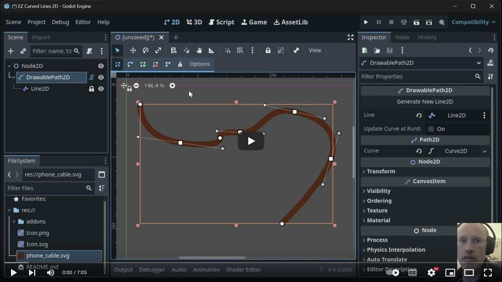

# EZ Curved Lines 2D for Godot 4.4

This plugin helps you draw curved lines quickly in the 2D editor.

- [EZ Curved Lines 2D for Godot 4.4](#ez-curved-lines-2d-for-godot-44)
  - [Polygon2D and CollisionPolygon2D - new in version 1.2.0](#polygon2d-and-collisionpolygon2d---new-in-version-120)
    - [Note on assigning CollisinPolygon2D](#note-on-assigning-collisinpolygon2d)
  - [Quick Start](#quick-start)
    - [1. Create a new 2D Scene](#1-create-a-new-2d-scene)
    - [2. Add a `DrawablePath2D` node to you scene tree (Ctrl + A)](#2-add-a-drawablepath2d-node-to-you-scene-tree-ctrl--a)
    - [3. In the `Inspector` tab click the `Generate New Line2D` button](#3-in-the-inspector-tab-click-the-generate-new-line2d-button)
    - [4. Start drawing your `DrawablePath2D` like a normal `Path2D`](#4-start-drawing-your-drawablepath2d-like-a-normal-path2d)
    - [5. You can change the properties of the `Line2D` in the inspector](#5-you-can-change-the-properties-of-the-line2d-in-the-inspector)
  - [Examples](#examples)
    - [A simple animated polygon](#a-simple-animated-polygon)
    - [A butterfly net](#a-butterfly-net)
  - [Explainer on Youtube](#explainer-on-youtube)
  - [Attributions](#attributions)

## Polygon2D and CollisionPolygon2D - new in version 1.2.0

Version 1.2 adds the exciting new ability to create curved Polygon2D and CollisionPolygon2D!

An updated quick start and youtube explainer will follow as soon as I have some more time available

They can be assigned to the DrawablePath2D node the same way as a Line2D (explained in the quickstart).

### Note on assigning CollisinPolygon2D

Note, however, that a `CollisionPolygon2D` will at first be generated as a direct child of the `DrawablePath2D` using
the `Generate CollisionPolygon2D` button, but it _does not_ need to be a child to remain succesfully assigned.

This way you can move it up the hierarchy of your scene to become a direct descendant of a `CollisionObject2D` (like `Area2D`, `StaticBody2D` or `CharacterBody2D`)

## Quick Start

After activating this plugin via `Project > Plugins` follow these steps.

### 1. Create a new 2D Scene

### 2. Add a `DrawablePath2D` node to you scene tree (Ctrl + A)

### 3. In the `Inspector` tab click the `Generate New Line2D` button

### 4. Start drawing your `DrawablePath2D` like a normal `Path2D`

Adding and manipulating points the normal way you would for a `Path2D`.

Creating curves using the `Select Control Points` mode:

.

### 5. You can change the properties of the `Line2D` in the inspector

Your new line will update every time you change the `Curve2D` of your `Path2D`

## Examples

### A simple animated polygon

### A butterfly net

## Explainer on Youtube

## Attributions

This plugin was fully inspired by [Mark Hedberg's blog on rendering curves in Godot](https://www.hedberggames.com/blog/rendering-curves-in-godot).

The suggestion to support both `Polygon2D` and `CollisionPolygon2D` was done by [GeminiSquishGames](https://github.com/GeminiSquishGames)