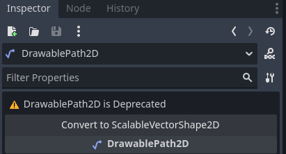
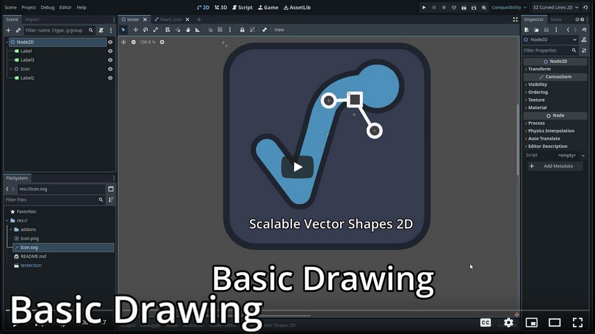
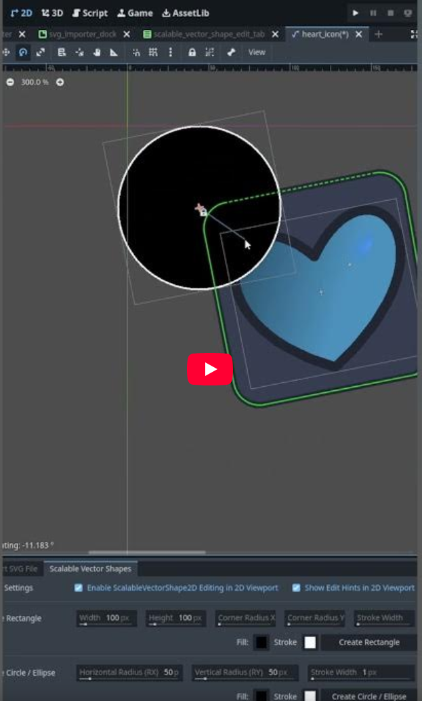
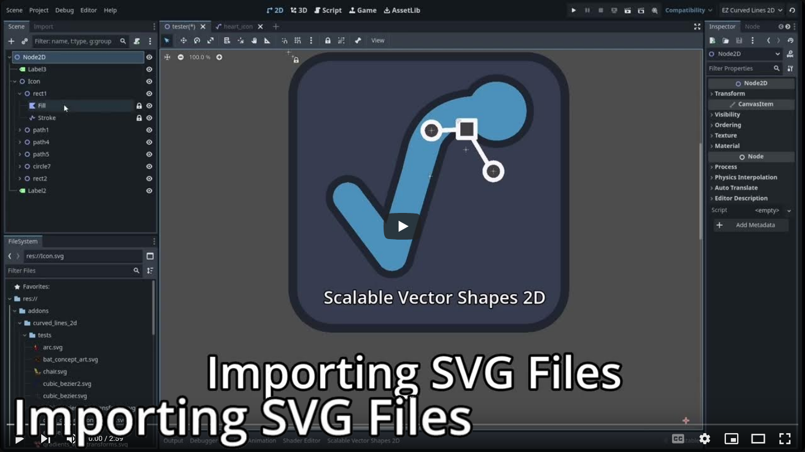
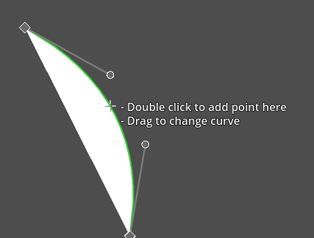
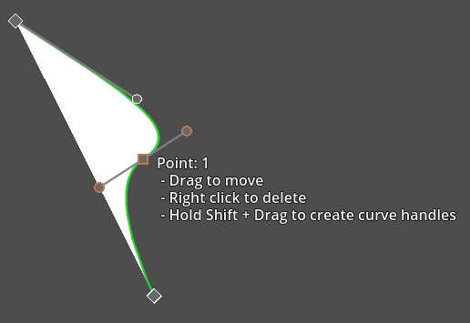
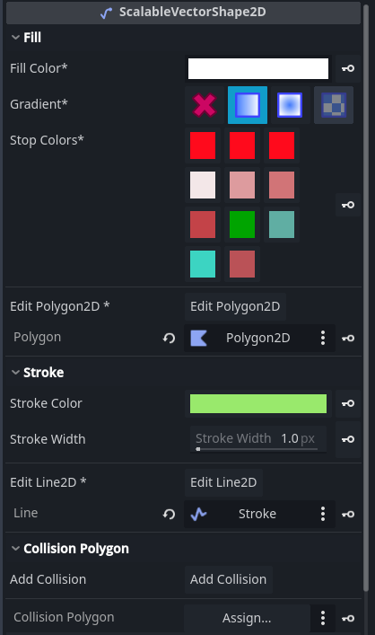

# Scalable Vector Shapes 2D plugin for Godot 4.4

Scalable Vector Shapes 2D lets you do 2 things:
1. Draw seamless vector shapes using a Path Editor inspired by the awesome [Inkscape](https://inkscape.org/)
2. Import [.svg](https://www.w3.org/TR/SVG/) files as seamless vector shapes in stead of as raster images

*__Important sidenote__: _This plugin only supports a small - yet relevant - subset of the huge [SVG Specification](https://www.w3.org/TR/SVG/struct.html)_

## Looking for EZ Curved Lines 2D?
The renamed plugin deprecates the old `DrawablePath2D` custom node in favor of `ScalableVectorShape2D`. A Conversion button is provided:

The reason is that `ScalableVectorShape2D` inherits directly from `Node2D` giving much more control to the plugin over how you can draw.

## Reaching out / Contributing
If you have feedback on this project, feel free to post an [issue](https://github.com/Teaching-myself-Godot/ez-curved-lines-2d/issues) on github, or to:

- Contact me on bluesky: [@zucht2.bsky.social](https://bsky.app/profile/zucht2.bsky.social).
- Try my free to play games on itch.io: [@renevanderark.itch.io](https://renevanderark.itch.io)

If you'd like to improve on the code yourself, ideally use a fork and make a pull request.

This stuff makes me zero money, so you can always branch off in your own direction if you're in a hurry.

# Table of Contents

- [Scalable Vector Shapes 2D plugin for Godot 4.4](#scalable-vector-shapes-2d-plugin-for-godot-44)
  - [Looking for EZ Curved Lines 2D?](#looking-for-ez-curved-lines-2d)
  - [Reaching out / Contributing](#reaching-out--contributing)
- [Table of Contents](#table-of-contents)
- [Drawing Shapes in the Godot 2D Viewport](#drawing-shapes-in-the-godot-2d-viewport)
  - [Basic Drawing Explainer on youtube](#basic-drawing-explainer-on-youtube)
  - [Adding a `ScalableVectorShape2D` node to your scene](#adding-a-scalablevectorshape2d-node-to-your-scene)
  - [Ctrl + click to add points](#ctrl--click-to-add-points)
  - [Add a `Line2D` as stroke and a `Polygon2D` as fill](#add-a-line2d-as-stroke-and-a-polygon2d-as-fill)
    - [More about assigned `Line2D`, `Polygon2D` and `CollisionPolygon2D`](#more-about-assigned-line2d-polygon2d-and-collisionpolygon2d)
      - [The assigned shapes are now siblings](#the-assigned-shapes-are-now-siblings)
      - [Yet they still respond to changes to your `ScalableVectorShape2D`](#yet-they-still-respond-to-changes-to-your-scalablevectorshape2d)
      - [Because you assigned them to it using the inspector](#because-you-assigned-them-to-it-using-the-inspector)
- [Generating a Circle, Ellipse or Rectangle using the bottom panel item](#generating-a-circle-ellipse-or-rectangle-using-the-bottom-panel-item)
- [Using the `.svg` importer](#using-the-svg-importer)
  - [Known issues explainer on Youtube:](#known-issues-explainer-on-youtube)
- [Manipulating shapes](#manipulating-shapes)
  - [Adding a point to a shape](#adding-a-point-to-a-shape)
  - [Bending a curve](#bending-a-curve)
  - [Creating, mirroring and dragging control point handles](#creating-mirroring-and-dragging-control-point-handles)
  - [Closing the loop and breaking the loop](#closing-the-loop-and-breaking-the-loop)
  - [Using `closed` on `Line2D`](#using-closed-on-line2d)
  - [Deleting points and control points](#deleting-points-and-control-points)
  - [Setting the pivot of your shape](#setting-the-pivot-of-your-shape)
- [Editing the properties of an assigned gradient (since release 2.3)](#editing-the-properties-of-an-assigned-gradient-since-release-23)
  - [Changing the start- and endpoint of the gradient](#changing-the-start--and-endpoint-of-the-gradient)
  - [Changing the color stop positions](#changing-the-color-stop-positions)
  - [Add new color stops](#add-new-color-stops)
- [Custom inspector forms (since release 2.2)](#custom-inspector-forms-since-release-22)
  - [A preview of the updated inspector](#a-preview-of-the-updated-inspector)
- [Animating / Changing shapes at runtime (improved in 2.4)](#animating--changing-shapes-at-runtime-improved-in-24)
  - [Youtube explainer on animating (outdated by release 2.4!)](#youtube-explainer-on-animating-outdated-by-release-24)
  - [A note up front (this being said)](#a-note-up-front-this-being-said)
  - [Animating the shape and gradients at Runtime](#animating-the-shape-and-gradients-at-runtime)
  - [Add keyframes in an animation player](#add-keyframes-in-an-animation-player)
  - [Don't duplicate `ScalableVectorShape2D`, use the `path_changed` signal in stead](#dont-duplicate-scalablevectorshape2d-use-the-path_changed-signal-in-stead)
  - [Performance impact](#performance-impact)
- [Ye Olde `DrawablePath2D` Examples](#ye-olde-drawablepath2d-examples)
- [Attributions](#attributions)

# Drawing Shapes in the Godot 2D Viewport

## Basic Drawing Explainer on youtube

After activating this plugin a new bottom panel item appears, called "Scalable Vector Graphics".

There are 3 ways to start drawing:
1. [Add a `ScalableVectorShape2D` node to your scene](#adding-a-scalablevectorshape2d-node-to-your-scene)
2. [Generating a Circle or Rectangle using the bottom panel item](#generating-a-circle-or-rectangle-using-the-bottom-panel-item)
3. [Using the `.svg` importer](#using-the-svg-importer)

## Adding a `ScalableVectorShape2D` node to your scene

This works exactly the same way as adding a normal godot node, using `Ctrl-A` or using right-click inside the 2D viewport and choosing `Add Node here`:

## Ctrl + click to add points

Once you added your new node, a hint should suggest you can start adding points by holding down the `Ctrl` key:

And once your are holding `Ctrl` down you can use `Left Click` to add points

## Add a `Line2D` as stroke and a `Polygon2D` as fill

After adding at least 2 points you can use the `Inspector` panel to generate a `Line2D` and/or a `Polygon2D` to serve as stroke and fill:

[Skip to further reading about manipulating shapes](#manipulating-shapes)

### More about assigned `Line2D`, `Polygon2D` and `CollisionPolygon2D`

Using the `Generate ...` buttons in the inspector simply adds a new node as a child to `ScalableVectorShape2D` but it does __not need to be__ a child. The important bit is that the new node is _assigned_ to it via its properties: `polygon`, `line` and `collision_polygon`:

#### The assigned shapes are now siblings

#### Yet they still respond to changes to your `ScalableVectorShape2D`

#### Because you assigned them to it using the inspector

# Generating a Circle, Ellipse or Rectangle using the bottom panel item

It's probably easier to start out with a basic primitive shape (like you would in Inkscape <3)

The second tab in the `Scalable Vector Shapes` panel gives you some basic choices:

This youtube short shows what adding a circle looks like:

# Using the `.svg` importer

As mentioned in the introduction, the `.svg` import supports a small - _yet relevant_ - subset of the [W3C specification](https://www.w3.org/TR/SVG/).

That being said, it's still pretty cool and serves my purposes quite well. You can drag any `.svg` resource file into the first tab of the bottom dock to see if it works for you too:

On the left side of this panel is a form with a couple of options you can experiment with. On the right side is an import log, which will show warnings of known problems, usually unsupported stuff:

As the link in the log suggest, you can report [issues](https://github.com/Teaching-myself-Godot/ez-curved-lines-2d/issues) on github; be sure to check if something is already listed.

Don't let that stop you, though, your future infinite zoomer and key-frame animator will love you for it.

## Known issues explainer on Youtube:

# Manipulating shapes

The hints in the 2D viewport should have you covered, but this section lists all the operations available to you.

## Adding a point to a shape

Using `Ctrl` + `Left Click` you can add a point anywhere in the 2D viewport, while your shape is selected.

By double clicking on a line segment you can add a point _inbetween_ 2 existing points:

## Bending a curve

Holding the mouse over line segment you can start dragging it to turn it into a curve.

## Creating, mirroring and dragging control point handles

When you have new node you can drag out curve manipulation control points while holding the `Shift` button. The 2 control points will be mirrored for a symmetrical / round effect.

Dragging control point handles while holding `Shift` will keep them mirrored / round:

Dragging them without holding shift will allow for unmirrored / shap corners:

## Closing the loop and breaking the loop

Double clicking on the start node, or end node of an unclosed shape will close the loop.

Double clicking on the start-/endpoint again will break the loop back up:

You can recognise the start-/endpoint(s) by the infinity symbol: ∞

## Using `closed` on `Line2D`

You do not always _need_ to close the `ScalableVectorShape2D` shape to draw a polygon, or a closed `Line2D`.

Setting the `closed` property on an assigned `Line2D` will display a dotted line over your shape:

 

## Deleting points and control points

You can delete points and control points by using right click.

## Setting the pivot of your shape

You can use the `Change pivot` mode to change the origin of your shape, just like you would a `Sprite2D`. In this case, the 'pivot' will actually be the `position` property of you `ScalableVectorShape2D` node.

This rat will want to rotate it's head elsewhere:

Like this:

# Editing the properties of an assigned gradient (since release 2.3)

Once a gradient is assigned to the 'Fill' of your shape via the inspector, its properties can be changed using the same controls as will the other handles.

## Changing the start- and endpoint of the gradient

Drag the outer orbit of the start- and endpoint of a the gradient line using the left mouse button to move them:

## Changing the color stop positions

Drag the color stops along the gradient line to change their position.

Right click to remove a color stop.

## Add new color stops

Double clicking on the gradient line will add a new color stop (the assigned color will be sampled from the existing color at that point)

# Custom inspector forms (since release 2.2)

The following custom forms were added, with extensive tooltips to help explain the actual functions they provide:

- Fill (actually the assigned `Polygon2D`)
- Stroke (actually the assigned `Line2D`)
- Collision Polygon (just a button to generate a new `Polygon2D`)

## A preview of the updated inspector

# Animating / Changing shapes at runtime (improved in 2.4)

## Youtube explainer on animating (outdated by release 2.4!)

This explainer will still work, but from version 2.4.0 onward much work has been done to add custom keyframe buttons.

## A note up front (this being said)

[Skip to animating shapes and gradients](#animating--changing-shapes-at-runtime)

The shapes you create will work fine with basic key-frame operations. You can even detach the Line2D, Polygon2D and CollisionPolygon2D from `ScalableVectorShape2D` entirely, once you're done drawing and aligning. Moreover, you probably should in 95% of the cases, to optimize your performance

## Animating the shape and gradients at Runtime

Sometimes, however, you want your shape to change at runtime.

You can use the `Update Curve at Runtime` checkbox in the inspector to enable dynamic changing of your curved shapes at runtime.

## Add keyframes in an animation player

You can then add an `AnimationPlayer` node to your scene, create a new animation and (batch) insert key frames for the following this:
- The entire shape of your `ScalableVectorShape2D`, which are:
  - `curve:point_*/position`
  - `curve:point_*/in`
  - `curve:point_*/out`
- All the gradient properties of your fill (`Polygon2D` assigned to `ScalableVectorShape2D`), which are:
  - `texture:gradient:colors` (the entire `PackedColorArray`)
  - `texture:gradient:offsets` (the entire `PackedFloat32Array`)
  - `texture:fill_from`
  - `texture:fill_to`
- Stroke width, i.e.: the `width` property of the assigned `Line2D`
- Stroke color, i.e.: the `default_color`  of the assigned `Line2D`
- Fill color, i.e.: the `color` of the assigned `Polygon2D`

## Don't duplicate `ScalableVectorShape2D`, use the `path_changed` signal in stead

When the `update_curve_at_runtime` property is checked, every time the curve changes in your game the `path_changed` signal is emitted.

Duplicating a `ScalableVectorShape2D` will __not__ make a new `Curve2D`, but use a reference. This means line-segments will be calculated multiple times on one and the same curve! Very wasteful.

If however you want to, for instance, animate 100 blades of grass, just use __one__ `DrawableShape2D` and have the 100 `Line2D` node listen to the `path_changed` signal and overwrite their `points` property with the `PackedVector2Array` argument of your listener `func`:

## Performance impact
Animating curve points at runtime does, however, impact performance of your game, because calculating segments is an expensive operation.

Also, the old [OpenGL / Compatibility](https://docs.godotengine.org/en/stable/contributing/development/core_and_modules/internal_rendering_architecture.html#compatibility) rendering engine seems to perform noticably better for these operations in 2D than the [Vulkan / Forward+](https://docs.godotengine.org/en/stable/contributing/development/core_and_modules/internal_rendering_architecture.html#forward) mode.

Under `Tesselation settings` you can lower `Max Stages` or bump up `Tolerance Degrees` to reduce curve smoothness and increase performance.

# Ye Olde `DrawablePath2D` Examples

Wondering where my beautiful rat, the leopard and butterfly net went?

I felt the installation started to become too cluttered, so I pruned them in this new release. Of course feel free to look them up in the [1.3.0.zip](https://github.com/Teaching-myself-Godot/ez-curved-lines-2d/archive/refs/tags/1.3.0.zip) / [1.3.0 source](https://github.com/Teaching-myself-Godot/ez-curved-lines-2d/tree/1.3.0/addons/curved_lines_2d/examples)

# Attributions

Lots of thanks go out to those who helped me out getting started:
- This plugin was first inspired by [Mark Hedberg's blog on rendering curves in Godot](https://www.hedberggames.com/blog/rendering-curves-in-godot).
- The suggestion to support both `Polygon2D` and `CollisionPolygon2D` was done by [GeminiSquishGames](https://github.com/GeminiSquishGames), who's pointers inspired me to go further
- The SVG Importer code was adapted from the script hosted on github in the [pixelriot/SVG2Godot](https://github.com/pixelriot/SVG2Godot) repository

